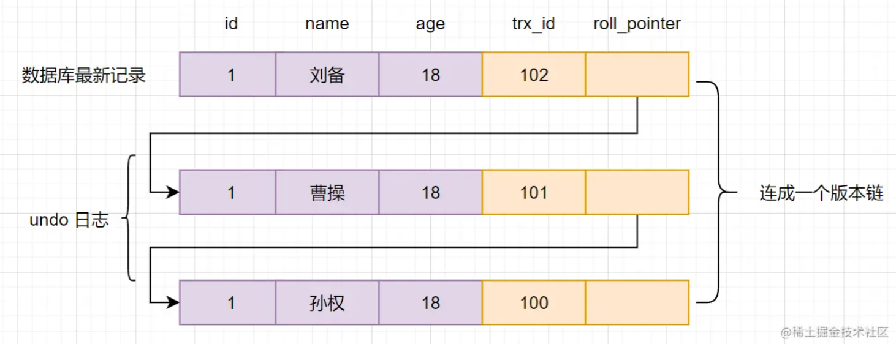
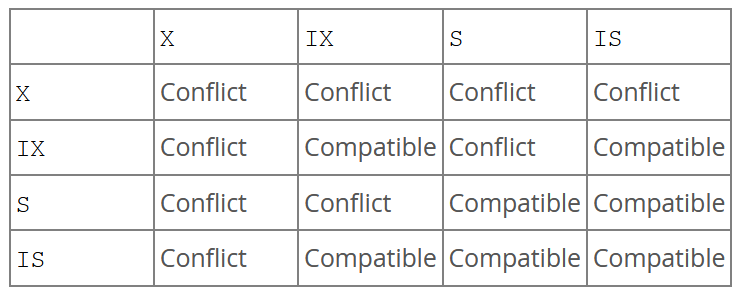

# MySQL

## 数据库的三范式

### 第一范式

列的原子性，每一列是不可分割的原子数据项

### 第二范式

实体的属性完全依赖（不存在只依赖于主关键字的一部分的属性）于主关键字

### 第三范式

任何非主属性不依赖于其他非主属性

## 键

**主键**：对表中对象予以唯一和完整标识的列的组合，一个对象只有一主键，且不能为空值

**外键**：一个表中存在的另一个表的主键，为此表的外键

**超键**：在关系中可以唯一标识元组的属性集。包含候选键和主键

**候选键**：最小超键，没有冗余元素

## MySQL 支持的存储引擎

InnoDB, MyISAM, Memory, Archive

|          | InnoDB         | MyISAM     |
| -------- | -------------- | ---------- |
| 事务     | ✅             | ❌         |
| 外键     | ✅             | ❌         |
| 索引     | 聚集索引       | 非聚集索引 |
| 全文索引 | ❌             | ✅         |
| 锁       | 行级锁，表级锁 | 表级锁     |

## 约束

**NOT NULL**: 字段内容不为空

**UNIQUE**：字段内容不重复

**PRIMARY KEY**：主键

**FOREIGN KEY**：外键，可以预防表之间关系的破坏动作 and 非法插入外键，因为必须是另一个表的主键值之一

**CHECK**：控制字段值的范围

```sql
CREATE TABLE Persons (
-- Create the "students" table
CREATE TABLE students (
    student_id INT PRIMARY KEY,
    first_name VARCHAR(50) NOT NULL,
    last_name VARCHAR(50) NOT NULL,
    date_of_birth DATE NOT NULL,
    CONSTRAINT uq_student_id UNIQUE (student_id)
);

-- Create the "courses" table
CREATE TABLE courses (
    course_id INT PRIMARY KEY,
    course_name VARCHAR(100) NOT NULL,
    max_students INT NOT NULL,
    CONSTRAINT chk_max_students CHECK (max_students > 0),
    CONSTRAINT fk_student FOREIGN KEY (course_id) REFERENCES students(student_id)
);

```

## varchar 与 char

char 是定长字段，无论实际存储多少内容，都只占用固定的长度：

- 实际长度小于 char 的长度，填充

- 大于 char 的长度：Strict SQL Mode:报错，Non-Strict SQL Mode:自动截取

varchar 变长字段，申请的只是最大长度，实际占用空间是字符长度 + 1

检索效率上 char 由于 varchar，所以如果预先知道字段的长度，优先使用 char

## in 与 exists

[来源](https://blog.csdn.net/wqc19920906/article/details/79800374)

**in**：首先执行子查询，将结果与外表做 hash join （m \* n 次）

```sql
SELECT * FROM A
WHERE id in (SELECT id FROM B);
```

伪代码：

```
List A = select * from A
List B = select id from B
result = []

for (a in A) {
    for (id in B) {
        if (a.id == id) {
            result.add(a)
            break
        }
    }
}
```

**exists**：返回 bool 变量，强调的是**是否**返回结果集，而不要求知道返回了什么。首先执行主查询， 再根据查询出的每一条记录判断 EXISTS 内的语句是否成立

```sql
SELECT * FROM A a
WHERE EXISTS (SELECT 1 FROM B b where a.id = b.id)
```

伪代码

```
List A = SELECT * FROM A
result = []

for (a in A) {
    if exists(SELECT 1 FROM B b where a.id = b.id) {
        result.add(a)
    }
}

```

A 有 m 条数据，B 有 n 条数据：

1. 如果两个表大小相当，效率差不多
2. A 大 B 小，用 IN，在内存中遍历比较，而不需要反复查询数据库
3. A 小 B 大，用 EXISTS，只执行 m 次查询，n 越大效果越明显
4. not IN 会对内外表都执行全表扫描，而 not EXISTS 会对内表使用索引，所以 not EXISTS 会比 not IN 效率高

## DELETE，DROP，TRUNCATE

|          | DELETE                   | DROP                              | TRUNCATE                   |
| -------- | ------------------------ | --------------------------------- | -------------------------- |
| 类型     | DML                      | DDL                               | DDL                        |
| 回滚     | ✅                       | ❌                                | ❌                         |
| 删除内容 | 表结构还在，删除指定数据 | 删除表， 所有数据行，索索引，权限 | 表结构还在，所有数据行没了 |
| 速度     | 慢                       | 最快                              | 快                         |

## 存储过程

预编译的 SQL 语句，有一些 T-SQL 语句组成的代码块，像一个方法一样实现某些功能，之后可以直接调用。执行效率比较高，降低了通信量

但是复用性不好，不适合快速迭代的工程

## MySQL 执行查询的过程

1. **连接器**：客户端发起 TCP 连接请求，MySQL 连接器进行权限验证，资源分配
2. 直接使用 SQL 语句与客户端其他原始信息查询缓存（k-v 哈希表）（任何字符的不同如空格都会导致无法命中缓存）**MySQL 的 8.0 版本以后，缓存被官方删除掉了**（失效频繁）
3. **分析器**：语法分析，把语句给到预处理器，检查数据表，数据列是否存在，解析别名看是否存在歧义
4. **优化器**：优化 SQL，根据执行计划进行最优的选择，匹配合适的索引
5. **执行器**：调用存储引擎的 API，执行查询

## SQL 的执行顺序

```sql
select distinct s.id from
T t join S s on t.id=s.id
where t.name="Yrion"
group by t.mobile having count(*)>2
order by s.create_time
limit 5;
```

执行顺序：每个步骤都会产生一个虚拟表，该虚拟表被用作下一个步骤的输入

- FROM <left_table> ：组装来自不同数据源的数据

- <join_type> JOIN <right_table>

- ON <join_condition>

- WHERE <where_condition> ：基于指定的条件对记录行进行筛选

- GROUP BY <group_by_list> ：将数据划分为多个分组

- WITH {CUBE | ROLLUP}

- HAVING <having_condition> ：筛选分组

- SELECT

- DISTINCT

- ORDER BY <order_by_list> ：对结果集进行排序

## 什么是数据库事务

[参考](https://juejin.cn/post/7016165148020703246)

事务是一个**不可分割**的数据库操作序列，是并发控制的基本单位

事务的执行结果是数据库从一种**一致性状态**变为另一种**一致性状态**

四个特征：ACID

- A 原子性：不可分割，要么都做要么都不做
- C 一致性：执行的结果必须是从一个一致性状态到另一个一致性状态
- I 隔离性：并发执行的事务之间互不干扰
- D 永久性：事务一旦提交，对数据库的改变是永久的，后续的操作/故障不会对其执行结果有影响

ACD 由 redo log 和 undo log 实现，I 由锁实现

## MySQL 隔离级别

### Read uncommitted 读未提交

事务会看见其他未提交事务的执行结果，很少用于实际应用，会发生**脏读**

### Read committed 读已提交

事务只能看见已经提交的事务做出的改变，可以避免脏读，但是不可重复读

### Repeatable read 可重复读

MySQL 默认隔离级别。一个事务中多次读取一个数据行，会看到同样的值

### Serializable 可串行化

强制事务排序，在每个读的数据行上加共享锁。可能导致大量超时和锁竞争

**脏读**：事务 A 读取事务 B**未提交**的更新数据后，B 进行了回滚

**不可重复读**：事务 A 多次读取同一条数据，读取结果不一致。（因为别的事务在多次读取的间隙更新了数据并提交了结果）**侧重修改** 不可重复读是否是个问题取决与这个数据库和业务的特点，有的时候不可重复读是可以接受的

**幻读**：事务对数据多次查询，其他事务此时插入或删除数据行，导致多次读取出现了不一样的结果

|                  | 脏读 | 不可重复读 | 幻读           |
| ---------------- | ---- | ---------- | -------------- |
| read uncommitted | ⭕   | ⭕         | ⭕             |
| read committed   | ✅   | ⭕         | ⭕             |
| repeatable read  | ✅   | ✅         | ⭕ \| ✅InnoDB |
| serializable     | ✅   | ✅         | ✅             |

## MVCC 多版本并发控制（A C D）

用来实现一致性的非锁定读；非锁定读是指不需要等待访问的行上 X 锁的释放。

数据库通过加锁来保证并发**写**事务的隔离性，但是频繁的加锁会降低数据库性能。所以使用多版本并发控制 MVCC 来实现**读**和**写**可以同时进行：某一条记录有多个版本同时存在，某个事务对其进行**读**的时候，会查看一条隐藏的**列事务版本 id**，比对事务 id，再根据事务隔离级别去判断读取哪个版本的数据（**写**依然需要加锁）

### 事务版本号（事务 id）

事务开启前从数据库获得一个自增的事务 id，可以通过比较大小判断事务执行的先后顺序

### 隐式字段

InnoDB 中每一条记录有两个隐藏字段：trx_id，roll_pointer，如果表中没有主键和非 NULL 的唯一键，还会有隐藏的主键列 row_id
| 字段 | 是否必须 | 描述 |
| ------ | ---- | ---------- |
| trx_id 事务 id | 是 |记录操作该数据的事务的事务 id |
| roll_pointer 回滚指针 | 是| 一个指针，指向回滚段的 undo log|
| row_id | 否 | 单调自增|

### undo log 回滚日志

记录数据被修改前的信息。

用于事务回滚的时候保证原子性和一致性；用于 MVCC 快照读

在表记录被修改前，先把数据拷贝到 undo log，如果事务回滚，就用 undo log 来还原数据。e.g., delete 数据，undo log 中多一条 insert 记录，update 数据，undo log 中多一条反向 update 记录

### 版本链

多个事务并行操作某一行数据修改，会产生多个版本，通过回滚指针形成一个链表，即版本链：


### Read View

**读未提交**：直接读取版本链中最新的数据即可
**读已提交** / **可重复读**：遍历版本链中的每一条记录，判断可见性。通过**Read View**实现。

Read view 包含：

1. m_ids：生成 read view 时活跃的读写事务的事务 id 列表
2. min_trx_id：m_ids 中的最小值
3. max_trx_id：生成 ReadView 时系统中应该分配给下一个事务的 id 值
4. creator_trx_id：生成该 read view 的事务的事务 id

可能的情况：

- 被访问的版本的 trx_id == creator_trx_id，可见，正在访问自己修改过的记录
- 被访问的版本的 trx_id < min_trx_id，可见，生成 read view 前这个版本已经被提交
- 被访问的版本的 trx_id >= max_trx_id，不可见，生成 read view 之后当前版本的事务才开启
- 被访问的版本的 trx_id 在 min_trx_id 和 max_trx_id 之间：判断 m_ids 中是否包含该事务 id，包含则不可见，不包含则可见（创建 read view 的时候已经提交）

READ COMMITTED 和 REPEATABLE READ 隔离级别的的一个非常大的区别就是它们生成 ReadView 的时机不同：

READ COMMITTED 在每次读取数据前都会生成一个 ReadView，这样就能保证每次都能读到其它事务已提交的数据。

REPEATABLE READ 只在第一次读取数据时生成一个 ReadView，这样就能保证后续读取的结果完全一致。

## 锁（I）

**锁的粒度**：行级锁，表级锁

1. 只有通过索引条件检索数据时，InnoDB 才会使用行级锁，否则会使用表级锁(索引失效，行锁变表锁)

2. 即使是访问不同行的记录，如果使用的是相同的索引键，会发生锁冲突

3. 如果数据表建有多个索引时，可以通过不同的索引锁定不同的行

### 共享锁

行级:

开启：`select...lock in share mode`，释放：事务结束，提交事务

表级:

```sql
LOCK TABLES
    tbl_name [[AS] alias] lock_type
    [, tbl_name [[AS] alias] lock_type] ...

lock_type: {
    READ [LOCAL]
  | [LOW_PRIORITY] WRITE
}

UNLOCK TABLES
```

### 排他锁

行级:

开启：增删改自动加锁，或`...for update`给一行数据加排他锁，释放：同共享锁

表级: 见上

### 意向锁

由数据库自动维护，用于指示事务即将对表中行的操作所需要的锁.

给一行数据加上共享锁之前，该表会先加上**意向共享锁 IS**;

给一行数据加排他锁之前，会先给表加上**意向排他锁 IX**。

意向锁相当于一个标志，用于给表加表锁的时候可以避免遍历检查表中是否有行级锁的存在。[参考](https://blog.csdn.net/nonage_bread/article/details/113092311)

表级锁的兼容性:


Intention locks do not block anything except full table requests

### Auto-Inc 锁(TODO)

自增锁是一种特殊的锁,如果表中存在自增字段,MySQL 会自动维护一个自增锁.

进行插入操作时,执行`select max(auto_inc_col) from t for update`并加 1 来获得计数器的值,自增长锁在插入完成就自动释放,而不需要等到事务完成

## 行锁的实现

### 记录锁 Record Lock

锁住聚簇索引的记录. 防止其他的更新,删除,插入操作. (对于没用定义 primary key 和 not null unique index, InnoDB 会在隐藏的 row ID 列生成一个 GEN_CLUST_INDEX 索引)

### 间隙锁 Gap Lock

where 条件中的列没有 unique 索引,或者没有索引,或者只包含唯一索引的部分列，并 S/X 锁时，InnoDB 会给记录之间的间隙上加上锁.

Gap lock 保证了 Repeatable Read 下不会出现幻读(把符合 where 条件的范围都上锁, 1.防止间隙内有新数据被插入 2.防止已存在的数据，更新成间隙内的数据)

不同事务可以在间隙上持有冲突锁。例如，事务 A 可以在间隙上持有共享间隙锁（间隙 S 锁），而事务 B 可以在同一间隙上持有独占间隙锁（间隙 X 锁）。允许冲突间隙锁的原因是，如果从索引中清除记录，则必须合并不同事务在该记录上持有的间隙锁。

缺点: 当检索不存在的值的时候,可能会导致锁定的范围扩大到无穷

例子:

| id(主键) | name     | age(普通索引) |
| -------- | -------- | ------------- |
| 1        | Ryan     | 15            |
| 5        | Meredith | 18            |
| 11       | Taylor   | 22            |
| 20       | Lea      | 28            |
**检索单个值**
```sql
##############session 1

SET autocommit=0;
SET session transaction isolation level REPEATABLE READ;

START TRANSACTION;
SELECT * FROM USER WHERE age=22 FOR UPDATE 

############session 2

SET autocommit=0;
SET session transaction isolation level REPEATABLE read;

START TRANSACTION;
INSERT INTO user VALUE(3, 'gap lock', 18) #成功
INSERT INTO user VALUE(6, 'gap lock', 18) #阻塞
INSERT INTO user VALUE(3, 'gap lock', 20) #阻塞
INSERT INTO user VALUE(10, 'gap lock', 22) #阻塞
INSERT INTO user VALUE(14, 'gap lock', 28) #阻塞
INSERT INTO user VALUE(21, 'gap lock', 28) #成功
```
**检索不存在的值**
```sql
##############session 1

SET autocommit=0;
SET session transaction isolation level REPEATABLE READ;

START TRANSACTION;
SELECT * FROM USER WHERE age=30 FOR UPDATE 

############session 2

SET autocommit=0;
SET session transaction isolation level REPEATABLE read;

START TRANSACTION;
INSERT INTO user VALUE(13, 'gap lock', 28) #阻塞
INSERT INTO user VALUE(14, 'gap lock', 100) #阻塞
INSERT INTO user VALUE(15, 'gap lock', 27) #成功
```
**检索范围**
```sql
##############session 1

SET autocommit=0;
SET session transaction isolation level REPEATABLE READ;

START TRANSACTION;
SELECT * FROM USER WHERE age>=18 AND age<23 FOR UPDATE 

############session 2

SET autocommit=0;
SET session transaction isolation level REPEATABLE read;

START TRANSACTION;
INSERT INTO user VALUE(11, 'select range', 14) #成功
INSERT INTO user VALUE(11, 'select range', 15) #阻塞
INSERT INTO user VALUE(12, 'select range', 17) #阻塞
INSERT INTO user VALUE(13, 'select range', 18) #阻塞
INSERT INTO user VALUE(14, 'select range', 20) #阻塞
INSERT INTO user VALUE(17, 'select range', 23) #阻塞
INSERT INTO user VALUE(18, 'select range', 24) #阻塞
INSERT INTO user VALUE(19, 'select range', 28) #成功
```

### 临键锁 Next-key Lock

同时锁住数据+间隙锁
在 Repeatable Read 隔离级别下，Next-key Lock 算法是默认的行记录锁定算法。

## 总结：四个事务隔离级别的实现

**Read uncommitted**：裸奔

**Read committed**：普通的 select 使用**快照读（snapshot read）**，底层是 MVCC；带锁的 select...in share lock，select...for update 以及更新操作（update，delete，insert）使用**记录锁**

**Repeatable read**：普通的 select 使用**快照读（snapshot read）**，底层是 MVCC；带锁的 select...in share lock，select...for update 以及更新操作（update，delete，insert）使用**当前读（current read）**，底层使用
