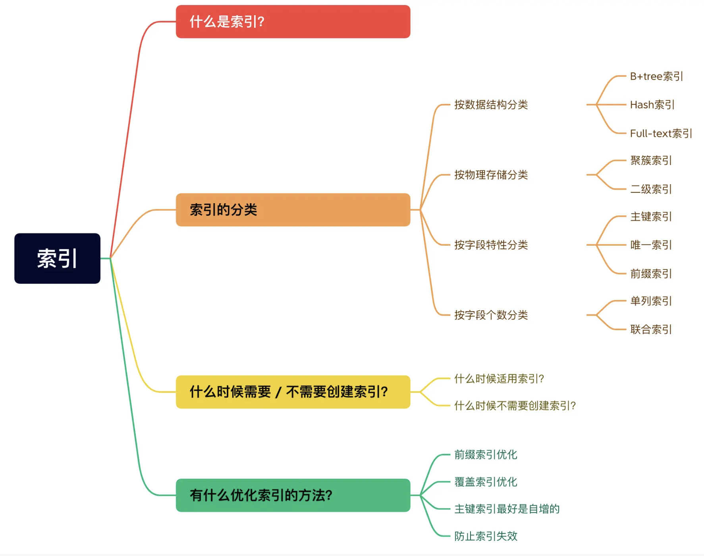
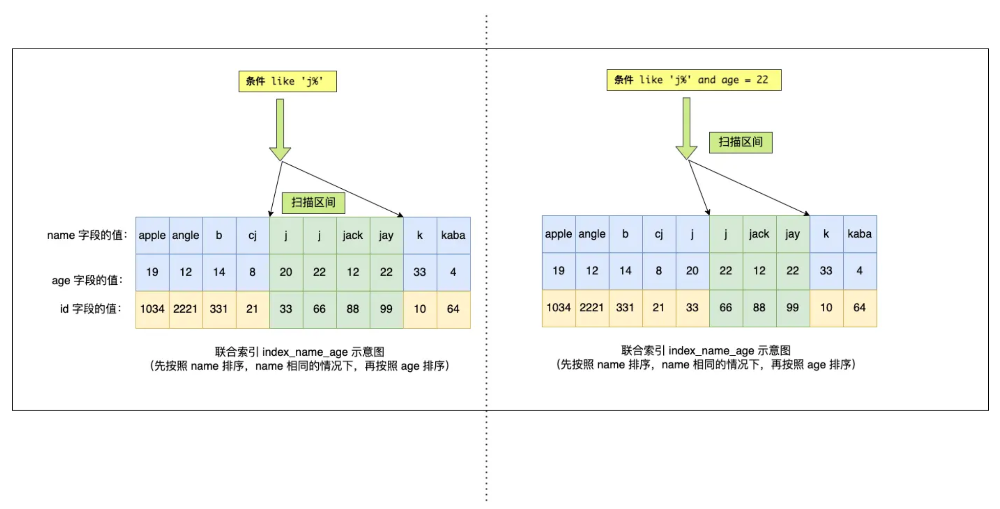

# 什么是索引

索引是帮助存储引擎快速获取数据的一种数据结构（空间换时间）

# 索引的分类

- 按「数据结构」：B+tree 索引、Hash 索引、Full-text 索引
- 按「物理存储」：聚簇索引（主键索引）、二级索引（辅助索引）
- 按「字段特性」：主键索引、唯一索引、普通索引、前缀索引
- 按「字段个数」分类：单列索引、联合索引
  

## 数据结构

## 物理存储

### 聚簇索引（主键索引）

叶子节点存放的是实际的数据

### 辅助索引（二级索引）

叶子节点放的是主键值，需要用找到的主键再去主键索引的 B+树里找到实际的数据（回表）

**p.s** 如果查找的数据在二级索引里就有（比如要找的就是主键），就不需要回表，此时称为“覆盖索引”

## 字段特性

### 主键索引

建立在主键字段上。一张表最多只有一个主键索引

### 唯一索引

建立在 UNIQUE 字段上的索引。

```sql
CREATE TABLE table_name  (
  ....
  UNIQUE KEY(index_column_1,index_column_2,...)
);
```

```sql
CREATE UNIQUE INDEX index_name
ON table_name(index_column_1,index_column_2,...);
```

### 普通索引

建立在普通字段上，不要求 unique

### 前缀索引

对字符类型字段（char、 varchar、binary、varbinary）的前几个字符建立的索引。减少索引占用的存储空间，提升查询效率

```sql
CREATE TABLE table_name(
    column_list,
    INDEX(column_name(length))
);
```

```sql
CREATE INDEX index_name
ON table_name(column_name(length));
```

## 字段个数

### 单列索引

建立在单列上的索引称为单列索引，比如主键索引

### 联合索引

多个字段组合成一个索引。

```sql
CREATE INDEX index_product_no_name ON product(product_no, name);
```

#### 最左匹配原则

用联合索引查询数据时，按从左到右的顺序比较位置，因此存在**最左匹配原则**。例如：创建了一个 (a, b, c) 联合索引，如果查询条件是以下这几种，就可以匹配上联合索引：

> where a=1；
>
> where a=1 and b=2 and c=3；
>
> where a=1 and b=2；

因为有查询优化器，所以 a 字段在 where 子句的顺序并不重要。

如果查询条件是以下这几种，联合索引就会失效:

> where b=2；
>
> where c=3；
>
> where b=2 and c=3；

因为(a, b, c) 联合索引，按照 a b c 的优先级排序，所以 b 和 c 是全局无序，局部相对有序的，在缺少 a 的情况下符合 where 条件的记录分布在各处，无法使用索引快速定位

#### 联合索引范围查询

范围查询时，联合索引的最左匹配原则会一直向右匹配直到遇到「范围查询」就会停止匹配。

例如：索引（a, b, c）
a 用到了联合索引确定，b 没有用到，需要扫描

```sql
select * from t_table where a > 1 and b = 2
```

a 用到了联合索引确定，b 在 a=1 的范围里也用到联合索引（a=1 的记录中 b 也是有序的）

在确定需要扫描的二级索引的范围时，当 a = 1 时，可以通过 b = 2 条件减少需要扫描的二级索引记录范围（b 字段可以利用联合索引进行索引查询）。从符合 a = 1 and b = 2 条件的第一条记录开始扫描，而不需要从第一个 a 字段值为 1 的记录开始扫描

```sql
select * from t_table where a >= 1 and b = 2
```

MySQL 中 BETWEEN 是闭区间，所以 a,b 都用上了索引

```sql
SELECT * FROM t_table WHERE a BETWEEN 2 AND 8 AND b = 2
```

索引（name, age）

name 用到了索引，在 name='j'的范围内，age 也用到了索引（如果 like 查询是以%开头，都不会使用索引）

```sql
SELECT * FROM t_user WHERE name like 'j%' and age = 22
```



#### 索引下推

对于联合索引部分命中的情况，比如`select * from table where a > 1 and b = 2`找到第一个满足条件的主键值后，还需要判断 b 是否等于 2，那是在联合索引里判断，还是回主键索引去判断呢？

MySQL 5.6 引入的索引下推优化（index condition pushdown）， 可以在联合索引遍历过程中，对联合索引中包含的字段先做判断，直接过滤掉不满足条件的记录，减少回表次数。

#### 索引区分度

建立联合索引时的字段顺序，对索引效率也有很大影响。要把区分度大的字段排在前面。区分度=distinct(columns)/count(*)，即不同值的个数「除以」表的总行数