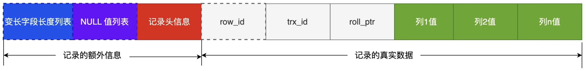

# 什么是索引

索引是帮助存储引擎快速获取数据的一种数据结构（空间换时间）

# 索引的分类

- 按「数据结构」：B+tree 索引、Hash 索引、Full-text 索引
- 按「物理存储」：聚簇索引（主键索引）、二级索引（辅助索引）
- 按「字段特性」：主键索引、唯一索引、普通索引、前缀索引
- 按「字段个数」分类：单列索引、联合索引
  

## 数据结构

## 物理存储

### 聚簇索引（主键索引）

叶子节点存放的是实际的数据

### 辅助索引（二级索引）

叶子节点放的是主键值，需要用找到的主键再去主键索引的 B+树里找到实际的数据（回表）

**p.s** 如果查找的数据在二级索引里就有（比如要找的就是主键），就不需要回表，此时称为“覆盖索引”

## 字段特性

### 主键索引

建立在主键字段上。一张表最多只有一个主键索引

### 唯一索引

建立在 UNIQUE 字段上的索引。

```sql
CREATE TABLE table_name  (
  ....
  UNIQUE KEY(index_column_1,index_column_2,...)
);
```

```sql
CREATE UNIQUE INDEX index_name
ON table_name(index_column_1,index_column_2,...);
```

### 普通索引

建立在普通字段上，不要求 unique

### 前缀索引

对字符类型字段（char、 varchar、binary、varbinary）的前几个字符建立的索引。减少索引占用的存储空间，提升查询效率

```sql
CREATE TABLE table_name(
    column_list,
    INDEX(column_name(length))
);
```

```sql
CREATE INDEX index_name
ON table_name(column_name(length));
```

## 字段个数

### 单列索引

建立在单列上的索引称为单列索引，比如主键索引

### 联合索引

多个字段组合成一个索引。

```sql
CREATE INDEX index_product_no_name ON product(product_no, name);
```

#### 最左匹配原则

用联合索引查询数据时，按从左到右的顺序比较位置，因此存在**最左匹配原则**。例如：创建了一个 (a, b, c) 联合索引，如果查询条件是以下这几种，就可以匹配上联合索引：

> where a=1；
>
> where a=1 and b=2 and c=3；
>
> where a=1 and b=2；

因为有查询优化器，所以 a 字段在 where 子句的顺序并不重要。

如果查询条件是以下这几种，联合索引就会失效:

> where b=2；
>
> where c=3；
>
> where b=2 and c=3；

因为(a, b, c) 联合索引，按照 a b c 的优先级排序，所以 b 和 c 是全局无序，局部相对有序的，在缺少 a 的情况下符合 where 条件的记录分布在各处，无法使用索引快速定位

#### 联合索引范围查询

范围查询时，联合索引的最左匹配原则会一直向右匹配直到遇到「范围查询」就会停止匹配。

例如：索引（a, b, c）
a 用到了联合索引确定，b 没有用到，需要扫描

```sql
select * from t_table where a > 1 and b = 2
```

a 用到了联合索引确定，b 在 a=1 的范围里也用到联合索引（a=1 的记录中 b 也是有序的）

在确定需要扫描的二级索引的范围时，当 a = 1 时，可以通过 b = 2 条件减少需要扫描的二级索引记录范围（b 字段可以利用联合索引进行索引查询）。从符合 a = 1 and b = 2 条件的第一条记录开始扫描，而不需要从第一个 a 字段值为 1 的记录开始扫描

```sql
select * from t_table where a >= 1 and b = 2
```

MySQL 中 BETWEEN 是闭区间，所以 a,b 都用上了索引

```sql
SELECT * FROM t_table WHERE a BETWEEN 2 AND 8 AND b = 2
```

索引（name, age）

name 用到了索引，在 name='j'的范围内，age 也用到了索引（如果 like 查询是以%开头，都不会使用索引）

```sql
SELECT * FROM t_user WHERE name like 'j%' and age = 22
```


#### 索引下推

对于联合索引部分命中的情况，比如`select * from table where a > 1 and b = 2`找到第一个满足条件的主键值后，还需要判断 b 是否等于 2，那是在联合索引里判断，还是回主键索引去判断呢？

MySQL 5.6 引入的索引下推优化（index condition pushdown）， 可以在联合索引遍历过程中，对联合索引中包含的字段先做判断，直接过滤掉不满足条件的记录，减少回表次数。

#### 索引区分度

建立联合索引时的字段顺序，对索引效率也有很大影响。要把区分度大的字段排在前面。区分度=distinct(columns)/count(\*)，即不同值的个数「除以」表的总行数

#### 联合索引进行排序

如何通过索引来提高查找效率？

```sql
select * from order where status = 1 order by create_time asc
```

给 status 和 create_time 列建立一个联合索引，因为这样可以避免 MySQL 数据库发生文件排序。

如果只用 status 创建索引，还要对 create_time 排序，这时就要用文件排序 filesort，也就是在 SQL 执行计划中，Extra 列会出现 Using filesort。

而利用索引的有序性，在 status 和 create_time 列建立联合索引，这样根据 status 筛选后的数据就是按照 create_time 排好序的，避免在文件排序，提高了查询效率。

# 需不需要创建索引？

索引可以提高查询速度，但是有一些缺点：

1. 占用物理空间
2. 创建和维护索引需要时间，而且随数据量增大而增大
3. 由 2，更新操作的效率会降低，每次都需要动态维护 B+树

## 适合建立索引的情况

1. 区分度高的字段
2. 经常用于 WHERE 查询条件的字段
3. 经常用于 GROUP BY 和 ORDER BY 的字段，这样在查询的时候就不需要再去做一次排序了

## 不适合建立索引的情况

1. 区分度低的字段
2. 表数据少的时候
3. 经常更新的字段
4. WHERE 条件，GROUP BY，ORDER BY 里用不到的字段

# 索引优化

- [前缀索引优化](#前缀索引优化)
- [覆盖索引优化](#覆盖索引优化)
- [主键索引自增](#主键索引自增)
- [索引非空值](#索引非空值)
- [防止索引失效](#防止索引失效)

## 前缀索引优化

使用某个字段中字符串的前几个字符建立索引：减小索引字段大小，可以增加一个索引页中存储的索引值，有效提高索引的查询速度

局限：

1. 无法使用 order by
2. 无法把前缀索引用作覆盖索引

## 覆盖索引优化

覆盖索引是 SQL 中 query 的所有字段，在索引 B+Tree 的叶子节点上都能找得到的索引，不在需要回表操作
例如：（product_id, name, brand）

```sql
select name, brand from products where product_id = 11209;
```

## 主键索引自增

B+树主键索引是按照主键的顺序存放的。

使用自增主键，每次插入的新数据就会按顺序添加到当前索引节点之后，不需要移动已有的数据，当页面写满，就会自动开辟一个新页面。

因为每次插入一条新记录，都是追加操作，不需要重新移动数据，因此这种插入数据的方法效率非常高。

如果我们使用非自增主键，由于每次插入主键的索引值都是随机的，因此每次插入新的数据时，就可能会插入到现有数据页中间的某个位置，这将不得不移动其它数据来满足新数据的插入，甚至需要从一个页面复制数据到另外一个页面，我们通常将这种情况称为**页分裂**。页分裂还有可能会造成大量的**内存碎片**，导致索引结构不紧凑，从而影响查询效率。

另外，**主键字段的长度不要太大**，因为主键字段长度越小，意味着**二级索引的叶子节点越小**（二级索引的叶子节点存放的数据是主键值），这样二级索引占用的空间也就越小。

## 索引非空值

1. 索引列存在 NULL 就会导致优化器在做索引选择的时候更加复杂，更加难以优化
2. NULL 会占用物理空间，InnoDB 存储记录的时候，如果表中存在允许为 NULL 的字段，那么行格式 (opens new window)中至少会用 1 字节空间存储 NULL 值列表：
   

## 防止索引失效

发生索引失效的情况：

### 对索引使用左或者左右模糊匹配

以%开头的模糊匹配：`like %xx` 或者 `like %xx%`

### 对索引列使用函数

比如 `from_unixtime(create_time) = ’2014-05-29’` 就不能使用到索引。语句

应该写成 `create_time = unix_timestamp(’2014-05-29’)`

### 对索引进行表达式计算

`where id + 1 = 10` 不走索引，`where id  = 10 - 1` 走索引

### 对索引隐式类型转换

MySQL 在遇到字符串和数字比较的时候，会自动把字符串转为数字，然后再进行比较。比如一个 phone 字段(char)，`where phone = 110` 会相当于对 phone 使用函数转换为 int，导致索引失效。

但是对于一个 int 字段，比如`where id = '11';` 并不会使索引失效

### 联合索引非最左匹配

联合索引要能正确使用需要遵循最左匹配原则，否则索引失效

### WHERE 子句中的 OR

在 WHERE 子句中，如果在 OR 前的条件列是索引列，而在 OR 后的条件列不是索引列，那么索引会失效
