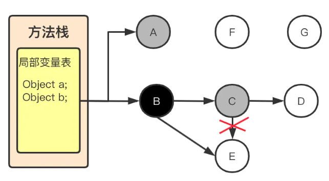
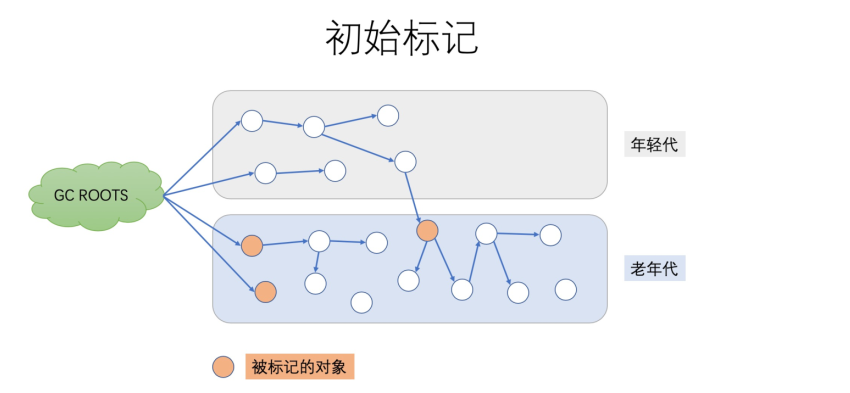
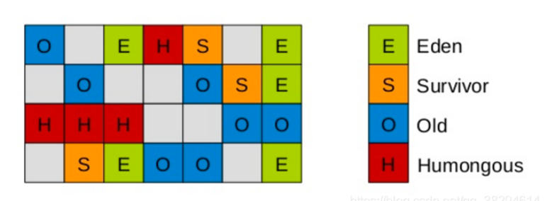

# 垃圾回收算法

1. 标记清除：效率低，产生大量的内存碎片
2. 标记整理：需要整理的过程，但是无内存碎片
3. 复制：内存分为两块，每次只用一块。回收的时候把存活对象移动另一块。速度快，无内存碎片，但空间利用率低

# 判断对象存活的方法

1. 引用计数：无法回收循环引用的对象
2. 可达性分析：从 GC root 开始向下搜索。找到没有引用链可以达到的对象。GC root：Java 栈中引用的对象；方法区类静态属性引用的对象；方法区常量池引用的对象；本地方法栈 JNI 引用的对象

# 分代收集理论

建立在两个假设的基础上：

1. 弱分代：大部分对象的生命周期都很短暂
2. 强分代：多次 GC 都存活的对象越不容易被回收

基于这两个假设，收集器将对象分为不同的区域，对象根据年龄生活在不同区域。分代收集有一个明显的问题，就是“跨代引用”：老年代对象引用新生代对象。因此总结出第三个假设：跨代引用相比于同带引用占少数。

因此不需要扫描整个老年代，也不需要浪费空间专门记录那些新生代由对象是跨代引用。只需要在新生代建立一个全局的数据结构（记忆集），把老年代分为多个区域，表示哪一块存在跨代应用，之后 minor GC 时，只有这些有跨代引用的内存会被加入扫描。

- Minor GC：新生代收集
- Major GC：老年代收集
- Full GC：整堆收集
- Mixed GC：在 Z1 收集器中，收集整个新生代和部分老年代

# 算法实现细节

## GC roots 根节点的枚举

HotSpot 中采用了 OOP Map 的数据结构，OOP Map 中存储了到底哪里有对象的引用，在扫描的时候就可以直接从 OOP Map 中获取到哪些位置有引用，就不需要遍历所有的 GC Roots。OopMap 中存储了两种对象的引用：

1. 栈里和寄存器内的引用
2. 对象内的引用

## 安全点

对象之间的引用关系随时都会发生改变，这意味着对应的 OopMap 需要同步进行更新。如果每一条指令的执行，都生成（或更新）对应的 OopMap，那么将会占用大量的内存空间，增加了 GC 的空间成本。JVM 引入 Safe Point 的概念，只有在 Safe Point 才会生成（或更新）对应的 OopMap。

用户线程执行过程中的一些特殊位置，当前的状态是确定的，线程有哪些对象、使用了哪些内存。

哪些地方适合放置 Safe Point？

1. 所有的非计数循环的末尾（防止循环体的执行时间太长，一直进入不了 Safe Point）
2. 所有方法返回之前
3. 每条 Java 编译后的字节码的边界

Safe Point 的数量不能太少，太少会导致进入 Safe Point 的前置时间过长，以至于垃圾回收线程等待的时间太长。Safe Point 的数量也不能太多，太多意味着将会频繁生成（或更新）OopMap ，会有性能损耗。

让所有线程在 GC 时都到达 Safe Point，有两种方法中断线程：

1. 抢占式中断(Preemptive Suspension)：JVM 中断所有线程，然后依次检查每个线程中断的位置是否为 Safe Point，如果不是则恢复这个线程，让它执行至 Safe Point 再阻塞。
2. 主动式中断(Voluntary Suspension)：大部分 JVM 实现都是采用主动式中断，需要阻塞用户线程的时候，首先做一个标志，用户线程会主动轮询这个标志位，如果标志位处于就绪状态，就自行中断。

## 安全区域

如用户线程处于 Sleep 或者 Blocked 状态， 这时候线程就没办法响应虚拟机的中断请求，但是虚拟机也不能一直干等着用户线程执行，因此就引入了安全区域，安全区域能确保在某一段代码片段中，引用关系不会发生变化。因此在这个区域任何位置开始垃圾收集都是安全的。

# 并发的可达性分析算法

## 三色标记

- **黑色**：已经遍历过并且可达的对象，并且其直接引用的对象也已经遍历过
- **灰色**：自身已经遍历过，但其直接引用的对象还未遍历完
- **白色**：待遍历或者遍历过但仍不可达对象，但是这个对象上至少存在一个引用还没有被扫描过

## 多标

并发标记阶段，被标记存活的对象的引用被删除，变成了不可达对象。造成浮动垃圾，等待下一次 GC 才可能被回收

## 漏标

问题发生的两个条件：

- 有至少一个黑色对象在自己被标记之后指向了白色对象
- 灰色对象在自己引用扫描完成之前删除了对白色对象的引用
  

## 解决方案

### 增量更新

破坏第一个条件（黑色对象在自己被标记之后指向了白色对象）。CMS 使用

当黑色对象插入新的指向白色对象的引用关系时，就将这个新插入的引用记录下来，等并发扫描结束后，再将这些记录过的黑色对象为根，重新扫描一遍。（黑色变灰色，避免浮动垃圾，但是重新扫描耗时）

## 原始快照（SATB Snapshot At The Begining）

破坏第二个条件（灰色对象在自己引用扫描完成之前删除了对白色对象的引用）。G1 使用

利用 pre write barrier 将所有即将被删除的引用关系的旧引用记录下来，最后以这些旧引用为根，STW 地重新扫描一遍即可避免漏标问题。（白色变灰色，本次 GC 不回收，效率高，但会产生浮动垃圾）

# 跨代引用

对象之间会存在跨代引用，假如进行一次只局限于新生代区域内的收集（Minor GC），但新生代中的东西有可能被老年代引用。

为了找出该区域中的存活对象，不得不在固定的 GC Roots 之外再额外遍历整个老年代中所有的对象来确保可达性分析结果的正确性。为了避免每次都要全堆扫描，JVM 在新生代上建立一个全局的数据结构（“记忆集”）。

## 记忆集（Remember Set）

一种抽象概念。记录 GC 时从非收集区域指向收集区域的指针集合。（老年代 -> 新生代）

## 卡表 Card Table

卡表最简单的形式可以只是一个字节数组，HotSpot 虚拟机是这么实现的

```java
CARD_TABLE [this address >> 9] = 0;
```

字节数组 CARD_TABLE 的每一个元素都对应着内存区域中的一块特定大小的内存块，这个内存块被称作“卡页”（Card Page）。

一般来说，卡页大小都是 2^N 字节数，如上面的代码，HotSpot 中使用的卡页是 2 的 9 次幂，即 512 字节（地址右移 9 位，相当于用地址除以 512）。

如果卡表标识内存区域的起始地址是 0x0000 的话，数组 CARD_TABLE 的第 0、1、2 号元素，分别对应了地址范围为 0x0000~0x01FF、0x0200~0x03FF、0x04FF~0x05FF 的卡页内存块。即从 0 开始、512 字节容量的相邻区域。

一个卡页的内存中通常包含不止一个对象，只要卡页内有一个（或更多）对象的字段存在着跨代指针，那就将对应卡表的数组元素的值标识为 1，成这个元素变脏（Dirty），没有则标识为 0。

在垃圾收集发生时，只要筛选出卡表中变脏的元素，就能轻易得出哪些卡页内存块中包含跨代指针，把他们加入 GC Roots 中一并扫描。

### 维护卡表-写屏障

在 HotSpot 虚拟机里是通过写屏障（Write Barrier）技术去维护卡表状态何时变脏、谁把他们变脏等。

# 常见垃圾回收器

## Serial

单线程，复制算法。回收过程必须停止用户线程（stop-the-world）

## ParNew

多线程，复制算法，stop-the-world（Serial 的多线程版本）

## Parallel Scavenger

多线程，复制算法，用于新生代，目标是达到可控的吞吐量

## Serial Old

单线程，标记整理，老年代，stop-the-world

## Parallel Old

多线程，标记整理， 老年代

## CMS

并发标记清除。以最短回收停顿时间为目标。

## G1

Garbage First，垃圾优先，主要面向服务端应用的垃圾收集器。

# CMS(Concurrent Mark Sweep)

并发（垃圾回收和用户线程同时进行），标记清除。以获取最短回收停顿时间为目标。

## 步骤

### 初始标记

STW。标记所有的根对象，根对象直接引用的对象，以及被年轻代中所有存活的对象所引用的老年代对象（只是标记一下 GC Roots 能直接关联到的对象，速度很快）


### 并发标记

根据上一步结果，多线程并发，向下标记所有的关联对象。无 STW。

对象的状态可能会发生变化，如下：

- 年轻代的对象从年轻代晋升到老年代
- 有些对象被直接分配到老年代
- 对象之间引用关系变化

CMS 使用“增量更新”避免并发标记问题，通过 write barrier 在对象进行赋值时将新插入的引用记录下来，并且按需记录新的引用关系。

## 并发预清理

与应用线程并发执行的。目的：让重新标记的 STW 时间尽可能短。

标记目标：

- 老年代中在并发标记中被标记为“dirty”的 card
- 幸存区（from 和 to）中引用的老年代对象

默认开启

### 重新标记

STW。重新扫描：新生代对象+GC Roots+被标记为“脏”区的对象，因为之前的预清理阶段是并发执行的，有可能 GC 线程跟不上应用程序的修改速度。

### 并发收集

此阶段与应用程序并发执行，不需要 STW 停顿。JVM 在此阶段删除不再使用的对象，并回收他们占用的内存空间。

## 缺点

1. 吞吐量低，执行垃圾收集时会占用一部分线程使程序吞吐量降低
2. 占用 CPU 资源，CMS 默认启动的回收线程是（CPU 核心数 +3）/4，CPU 核数越少，占用资源就越多 3.内存碎片问题，使用的是标记-清除算法，导致大对象无法分配，就会触发 Full GC
3. 无法处理“浮动垃圾”

如果系统追求低延迟，那么可以选择 CMS 垃圾收集器，只是 STW 的时间缩短了，但是整个 GC 的时间相对更长了；

如果系统追求高吞吐，那么可以选择并行 Parallel GC，虽然 STW 的时间长，但是可以保证非 GC 时间，整个系统的资源全部被应用线程占用。

# G1

Garbage First，垃圾优先，主要面向服务端应用，支持指定所在一个长度为 M 毫秒的时间片段内，消耗在垃圾收集上的时间大概率不超过 N 毫秒这样的目标。适用于大内存、多 CPU 的机器。

## 设计

之前的垃圾收集器要么收集新生代，要么收集老年代。G1 则是面向所有堆内存，根据哪一个区域的垃圾最多，回收收益最大来收集垃圾。

## 区域划分

### Region

将 Java 堆划分为多个大小相等的 region。每个 Region 都可以是新生代，老年代。一般大小时 2 的 N 次幂。

### Humongous 区域

用来存放大对象（超过 region 一半的对象，超过整个 region 的对象会被存放在多个连续的 Humongous 区域）被看作是老年代的一部分。



## 垃圾收集过程

全局并发标记 + 拷贝存活对象。两部分可以独立运行

### 全局并发标记

基于原始快照（SATB）

1. 初始标记（STW）：标记对象类似 CMS，初始标记阶段借用 yong GC 的暂停，因而没有额外的、单独的暂停阶段。
2. 并发标记：过程中还会扫描 SATB 写屏障（write barrier）所记录下的引用
3. 最终标记（STW）：处理在并发标记阶段剩余未处理的 SATB 写屏障的记录。这个暂停与 CMS 的 remark 有一个本质的区别，这个暂停只需要扫描 SATB buffer（将这些旧引用作为根重新扫描一遍，避免漏标），而 CMS 的 remark 需要重新扫描 dirty card 外加整个根集合，而此时整个 Yong 区不管对象死活都会被当做根集合的一部分，因而 CMS remark 有可能会非常慢。
4. 清理（STW）：统计每个 region 被标记为活的对象有多少。如果 region 中无存活对象，就将整个 region 回收，放到可分配列表中。

### 拷贝存活对象（STW）

把一部分 Region 中的存活对象拷贝到空闲的 Region 里。回收原本的 region 空间。

可以任意选择多个 region 来构成收集集合（Collection Set），靠每个 Region 的 RSet 实现。然后并行复制。

可以进行 Young GC 或者 Mixed GC(所有年轻代和部分老年代)

## 优点

1. 延迟可控，高吞吐量
2. 可指定期望停顿时间
3. 不会产生空间碎片
4. 原始快照速度更快地处理跨代引用

## 缺点

如果 Mixed GC 无法跟上程度分配内存的速度，导致 Old 区域填满无法分配内存时，就会切换到 G1 之外的 Serial Old GC 来收集整个 Java 堆（包括 Yong、OId、Permgen），也就是 Full GC
