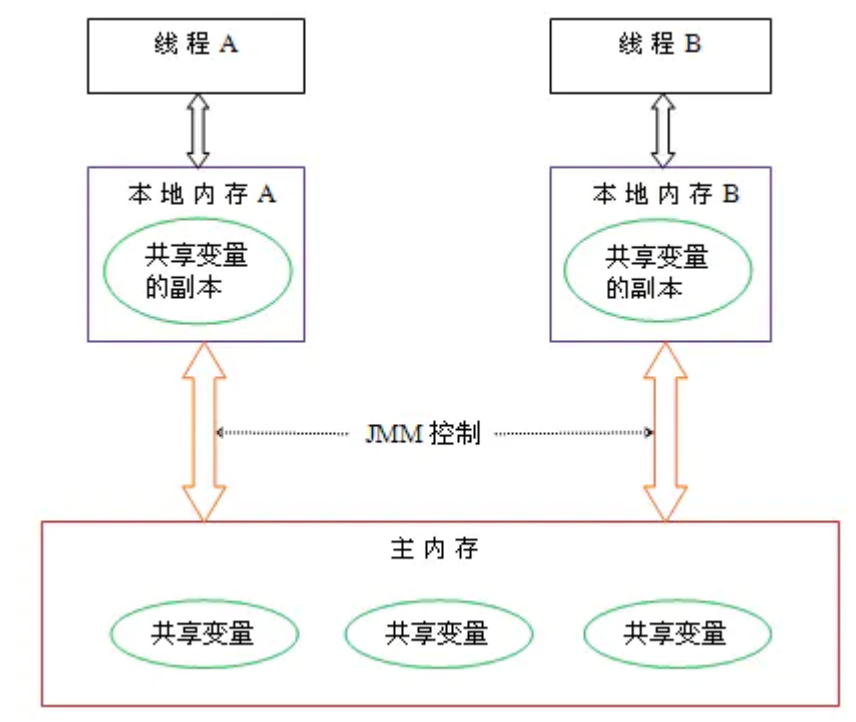

# JVM 内存模型

线程私有：

- 程序计数器：当前线程正在执行的指令的地址
- Java 栈：每个方法执行的时候会创建一个栈帧，存放局部变量表，操作数，动态链接，方法返回信息
- 本地方法栈：保存 native 方法，通过动态链接直接调用方法

线程共享：

- 堆：几乎所有的对象实例和数组都在堆上分配内存。
- 方法区：存放已被加载的类信息，常量，静态变量，即时编译的代码数据。

# Java 内存模型 JMM

在底层处理器内存模型的基础上，定义自己的多线程语义。明确一组排序规则，保证线程之间的可见性。保证在不同结构的处理器上都可以正确运行。

每个线程都有自己的本地内存。对主内存中变量的修改，是通过更新自己本地内存中的副本，再刷新到主内存中实现的。


Java 提供了几种语言结构：volatile，final，synchronized，来向编译器描述并发要求：

- volatile：可见性，有序性
- synchronized：代码块的可见性，有序性（底层是 monitor），但不禁止代码块内部的重排序。
- final：禁止构造函数初始化和给 final 字段赋值的重排序，保证可见性。

## Happens-before 规则：

- 单线程中，每个动作 happens-before 后续的每个动作
- Monitor 锁定规则：monitor 解锁动作 happens-before 后续对这个 monitor 的锁定动作
- 对 volatile 变量的写入 happens-before 后续多这个变量的读取
- 线程 start() happens-before 线程内的任意动作
- 一个线程的所有动作 happens-before 其他线程在该线程 join()成功返回
- 传递性：A happens-before B, B happens-before C, 那么 A happens-before C

# Java 常量池

## 全局字符串池（String Pool 或 String Literal Pool）

类加载完成，经过验证，准备阶段之后，在堆上生成的字符串对象实例，将它们的**引用**存在字符串常量池中。

```java
String a = new String("aaa");
String b = "aaa";
String c = a.intern();
a == b; // false
b == c; // true
```

先在堆上创建“aaa”的字符串对象，并将引用保存到字符串常量池中，再在堆上创建一个字符串对象，并把引用赋值给 a。相当于需要创建两个对象

## class 文件常量池（constnt pool table）

class 文件中除了包含类的版本，字段，方法，接口等信息外，还有一个常量池。

这个常量池保存编译器生成的各种字面量（literal）和符号引用（symbolic reference）：

- 字面量：就是常量的概念，如字符串，声明为 final 的常量值
- 符号引用：用一组符号来代表所引用的目标，用来无歧义的定位目标。包括下面三类：
  - 类和接口的全限定名
  - 字段的名称和描述符
  - 方法的名称和描述符

## 运行时常量池

jvm 对类进行加载，链接（验证，准备，解析），初始化。

类加载到内存后，jvm 会把 class 文件常量池的内容存到类的运行时常量池中。因此每个类都有一个自己的运行时常量池。

经过解析之后，把符号引用替换为直接引用，解析的过程还会去查询字符串常量池。
