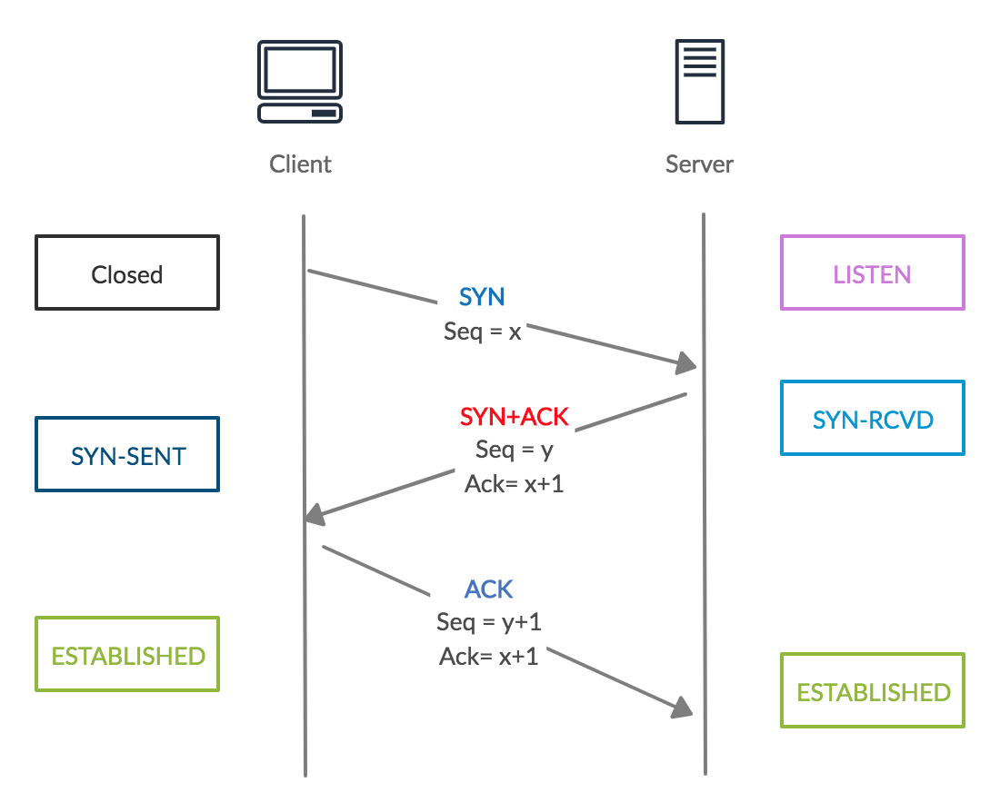
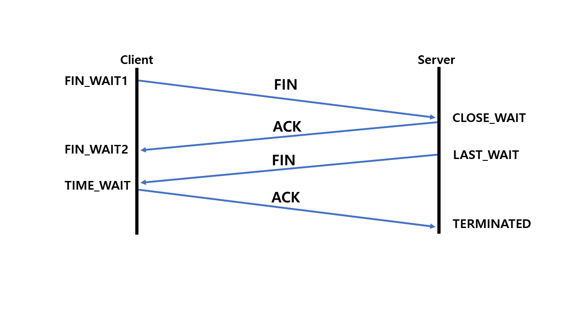

# 计算机网络协议栈

## OSI 七层模型

理论模型：

- 应用层：为应用程序提供服务，如 DNS,HTTP，SMTP
- 表示层：负责数据格式转换，如加解密，压缩解压等
- 会话层：负责在网络中两节点之间简历，维持，终止通信。如服务器验证用户登录
- 运输层：向主机进程提供数据传输服务。TCP：面向连接，可靠的；UDP：无连接，最大努力传输的，不可靠。
- 网络层：选择合适的路由和交换节点，确保数据及时传送，如 IP
- 数据链路层：将网络层数据包装成帧，在相邻节点的链路上传输，如 MAC
- 物理层：相邻节点比特流的传输，屏蔽传输介质的不同

## TCP/IP 四层模型

网络接口层，网络层，运输层，应用层

# TCP 与 UDP 的区别

|          | UDP                            | TCP                          |
| -------- | ------------------------------ | ---------------------------- |
| 连接     | 无连接                         | 面向连接                     |
| 可靠性   | 不可靠                         | 可靠传输：流量控制，拥塞控制 |
| 有序性   | 无序                           | 有序                         |
| 传输速度 | 快                             | 慢                           |
| 对象个数 | 一对一，一对多，多对一，多对多 | 一对一                       |
| 传输方式 | 报文                           | 字节流                       |
| 首部开销 | 小，8 字节                     | 大，20~60 字节               |

# TCP 三次握手

Client: SYN, SYN = 1, 随机初始序列号 seq=x。SYN-SENT

Server: SYN-ACK, SYN = 1, ACK = 1, ack = x + 1,随机初始序列号 seq=y，SYN_RECV

Client: ACK, ACK = 1, seq = x + 1, ack = y + 1, ESTABLISHED

Server: ESTABLISHED

三次挥手可以让双方都确认自己的接收能力和发送能力都是正常的。

仅靠前两次握手无法确认功能正常，且有可能发生第一次连接请求在后一次连接断开后才到达，而 client 并没有意识到产生了新的请求，从而导致服务器单方面等待，资源浪费。

第二次握手是 SYN 和 ACK 一起发送的，所以只需要三次，而不是四次握手

# SYN 泛洪攻击

DOS 攻击的一种，大量发送半连接请求，耗费服务器资源。服务器不断重发 SYN-ACK 而得不到回应，从而影响了正常的连接请求。

## 三次握手最后一个 ACK 丢失：

服务端根据超时重传机制重发 SYN-ACK 包，知道超时关闭连接。

客户端以为连接已经建立，发送数据时会受到服务端的 RST 包，此时才得知连接失败，断开连接。

## 监测

服务器上有大量半连接状态，且源 IP 随机

## 防范

防火墙，路由器过滤

加固 TCP/IP 协议栈防范：增加最大半连接数量，缩短超时时间

# TCP 四次挥手

客户端主动关闭连接：FIN=1，ACK=1，seq=u=x+1, ack=k=y+1， FIN_WAIT_1

服务端接收到 FIN 立马发出 ACK，seq=k, ack=u+1, CLOSE_WAIT

客户端收到 ACK，进入 FIN_WAIT_2

服务端发送 FIN，seq=m 即上次发送报文最后一个字节的序号+1，ack=u+1，LAST_ACK

客户端发送 ACK，ack=m+1,ack=u+1, TIME_WAIT 2msl（2 倍最大报文寿命）TIME_WAIT，然后 CLOSE

服务端收到 ACK，CLOSED

## TIME_WAIT 2 MSL

1. 确保 ACK 可以到达服务端，并接受超时重传的 FIN

2. 等待 2 MSL 是为了防止上一个连接中丢失的报文，在下一次相同两方连接建立之后送达, 导致客户端无法确定报文是否是新的连接的报文。（TCP 要求 2MSL 内不使用相同的序列号）

# TCP 如何保证传输可靠性

## 校验和

接收端监测数据是否有差错

## seq 和 ack

向对方确认自己接收到的数据，并且可以根据序列号对数据进行排序，去重

## 滑动窗口

提高报文传输效率，同时避免一次发送过多导致**接收方**来不及处理

## 超时重传

动态计算的最大超时时间

## 拥塞控制

防止**双方之间的网络链路**上发送阻塞，保证可靠性和性能

## 流量控制

互相了解双方的缓冲区大小，从而控制发送方发送的数据量

# TCP 滑动窗口

每次等到 ACK 在发送下一段数据是十分缓慢的，所以引入了滑动窗口，表示不需要等待 ACK 就可以持续发送的数据包的最大值。

窗口左边是已经发送且收到 ACK 的包

窗口内的左半部分是已经发送的包，但未收到 ACK

窗口内的右半部分是可以发送，等待被发送的包

收到 ACK 后，窗口会向右移动

滑动窗口起到了限流的作用，决定了 TCP 发送包的速率。滑动窗口的大小取决于拥塞控制窗口和流量控制窗口的最小值。

# TCP 拥塞控制

四种算法分别作用在不同的阶段 + 发送方的拥塞控制窗口 cwnd

- 慢开始 slow-start
- 拥塞避免 congestion avoidance
- 快速重传 fast retransmit
- 快速恢复 fast recovery

## 慢开始

从 1 开始，每收到一个 ACK，就将 CWND 的长度增加 1 MSS（maximum segment size），因此约为每一个 RTT 长度翻倍，直到：

1. 长度达到接收方的 rwnd，停止发送直到收到 ACK 和
2. 通过快速重传监测到丢包发生，TCP reno 算法快速恢复
3. 通过超时监测到丢包发生，此时 ssthresh 减到已发送未 ACK 的数据的一半，或者 2\*MSS， cwnd 重置为 1，ssthresh 成为原先 cwnd 的一半
4. 长度达到 slow start threshold (ssthresh)，此时切换到拥塞避免

## 拥塞避免

达到 ssthresh 后，每结果一个 RTT，cwnd 加 1，线性增长

## 快速重传

对于**接收方**来说，如果收到一个**失序**报文，就**立马发出重复确认**，而非等到自己有发送数据之后再稍带回去。

## 快速恢复

发送方配合接收方的快速重传：如果收到 3 个重复确认，将 ssthresh 减为 cwnd 的一半，cwnd 也同时变为一半，并且开始新的拥塞避免阶段（线性增加）。这种算法避免了 TCP Tahoe 中重新从 slow start 开始。TCP Tahoe 已经不适用于现在的网络环境了。

# HTTP 常见状态码

200：ok

301：永久移动

302：临时移动

400：bad requests，请求有错误

403: forbidden，拒绝服务

404：找不到请求的网页

500：服务器错误

# HTTP 请求方式

- GET：获取资源
- POST：更新实体主题
- PUT：新增数据
- DELETE：删除数据
- PATCH：对资源进行部分修改

GET 是幂等的，POST 不是

# HTTP 1.0 与 HTTP 1.1

1.0 每次请求都需要重新建立连接，1.1 支持长连接（connection：keep-alive）

1.1 支持流水线 pipeline，在一个 TCP 连接上发送多个 HTTP 请求，而不需要逐个发送并等待回复

1.1 加入了更多的缓存控制策略，如（TODO）

带宽优化：支持请求资源的某个部分

错误通知：新增了 24 个错误状态码，比如 410 Gone 表示资源被永久删除

Host 头处理：支持多个不同的主机名共享一个 IP

# HTTP 1.1 与 HTTP 2.0

1.1 基于文本，2.0 基于二进制格式解析，更加健壮

多路复用（连接共享）：同域名下的通信都在单个连接上完成，这个连接上的请求和响应是交错的。同时每个消息分为多个帧，乱序发送，靠帧首部的流标识来组装

优先级

头部压缩：将 1.1 Header 中的大量信息进行了编码，来减小头部大小，同时双方各自缓存一份 header fields 表，这样每次通讯就不需要重复传输相同的 header 内容

服务端推送：服务端可以向客户端推送额外资源，不需要向客户端明确请求

# HTTPS 的原理

1. 客户端请求 https 网址，连接到服务端的 443 端口
2. 服务端必须有 CA(Certification Authority)证书（包含颁发机构，公司信息，证书有效期等）。颁发证书的同时会生成一个私钥和一个公钥。公钥附带在证书中，证书本身还有一个数字签名，用于验证证书的完整性和真实性。
3. 服务端将证书发送给客户端，客户端会对证书进行验证。
4. 证书没问题，就生成随机数 KEY 用公钥加密后发送给服务端，作为对称加密的密钥。
5. 开始加密传输数据

# 浏览器输入网址后的全过程

1. 域名解析将网址解析为 IP 地址：浏览器 DNS 缓存，操作系统 DNS 缓存，操作系统 hosts 文件，向本地 DNS 服务器递归查询。本地 DNS 服务器迭代查询
2. TCP 三次握手建立连接
3. 发起 http 请求
4. 服务端响应请求
5. 浏览器解析 html 代码，请求 html 中的资源，渲染页面

# Cookie 和 Session
