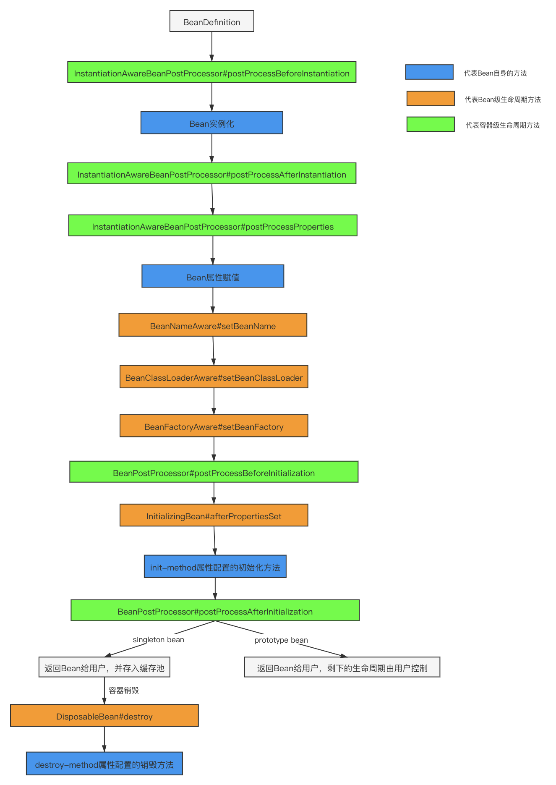
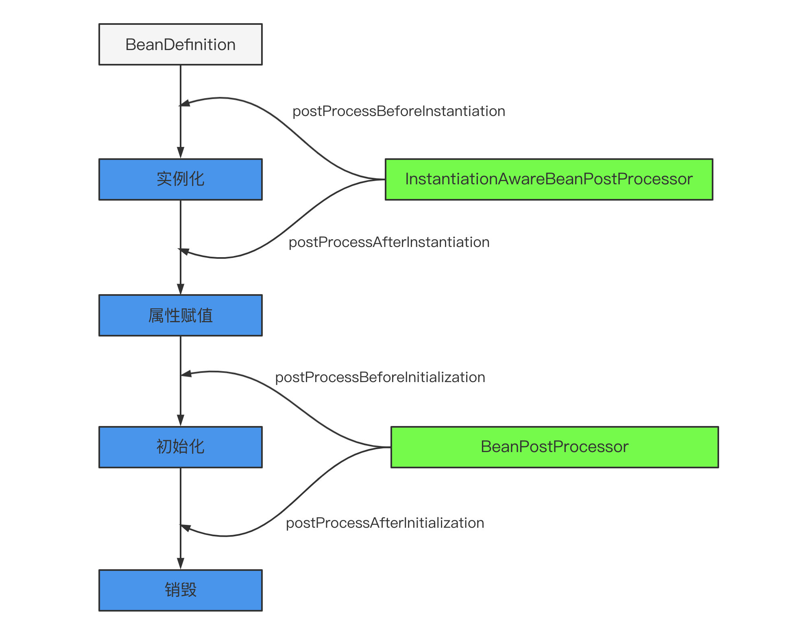

# Bean🫘
## 什么是Spring bean
就是被IoC容器管理的对象。可以通过XML文件，注解，或者Configuration配置类来定义
```xml
<?xml version="1.0" encoding="UTF-8"?>
<beans xmlns="http://www.springframework.org/schema/beans"
       xmlns:xsi="http://www.w3.org/2001/XMLSchema-instance"
       xsi:schemaLocation="http://www.springframework.org/schema/beans
    http://www.springframework.org/schema/beans/spring-beans-4.3.xsd">

    <import resource="引入其他bean xml配置文件" />
    <bean id="bean标识" class="玩转类型名称"/>
    <alias name="bean标识" alias="别名" />

</beans>
```

```java
@Component
public class MyBean {

}
```

```java
@Configuration
public class MyConfig {
    @Bean
    public AnotherBean anotherBean() {
        return new AnotherBean();
    }

}
```

## 将一个类声明为Bean的注解
```@Component```：通⽤，可标注任意类为 Spring 组件

```@Repository```：持久层（Dao 层）

```@Service```：服务层，涉及复杂的逻辑，需要⽤到 Dao 层

```@Controller```：Spring MVC 控制层，接受⽤户请求，调⽤Service返回数据给前端

```@Bean```：注解在方法上表示方法返回一个bean。⽐ @Component 注解的⾃定义性更强，⽽且很多地⽅我们只能通过 @Bean 注解来注册 bean。⽐如引⽤第三⽅库中的类需要装配到 Spring 容器时，只能通过 @Bean 来实现


## Bean的作用域
通过```@Scope(value = ConfigurableBeanFactory.SCOPE_PROTOTYPE)```注解或者```<bean id="..." class="..." scope="singleton"></bean>```xml来定义bean的作用域
### singleton单例
容器中只有一个该类的bean实例，Spring默认单例
### prototype
每次获取都是创建一个新的bean实例
### request
在Web应用中，每个HTTP请求生成一个新的bean
### session
在Web应用中，每个来自新session的HTTP请求生成一个新的bean
### application
在Web应用中，每次应用启动生成一个新的bean
### websocket
在Web应用中，每次WebSocket会话生成一个新的bean

## singleton的线程安全问题
多个线程操作同一个bean存在资源竞争

解决办法：
1. 尽量避免定义可变的成员变量
2. 在bean中定义ThreadLocal来保存成员变量

不过一般bean都是无状态的，只有方法。如DAO, Service

## Bean的生命周期(TODO)
[来源](https://blog.csdn.net/riemann_/article/details/118500805)


实例化 Instantiation-> 属性赋值 Populate -> 初始化 Initialization -> 销毁 destruction

Spring Bean的生命周期有很多扩展点.

### 容器级别的方法: BeanPostProcessor
为我们提供了一些可以对bean直接进行修改的hooks,会对容器中的所有bean产生作用

#### InstantiationAwareBeanPostProcessor接口(extends BeanPostProcessor)
```postProcessBeforeInstantiation()```在bean实例化之前调用,会把原本的bean替换为代理,是AOP等功能实现的关键点

```postProcessBeforeInstantiation()```实例化之后调用,如果返回false,后续的属性填充和属性依赖注入(```populateBean```),```postProcessPropertyValues```不会执行,但初始化, BeanPostProcessor任然会执行

